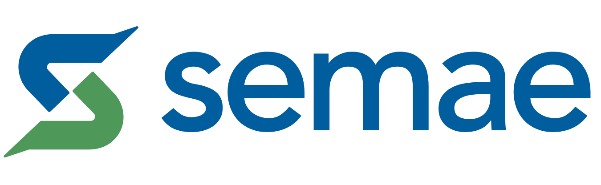

# GeoEstruturas AI — Plataforma de Levantamento e Contagem de Estruturas em Imagens Aéreas

> **Análise e levantamento de edificações em comunidades e assentamentos precários por visão computacional assistida por inteligência artificial.**



---

## 1. Visão Geral do Sistema

O **GeoEstruturas AI** é uma solução de engenharia territorial desenvolvida para projetos de saneamento básico, regularização fundiária e planejamento urbano. O sistema substitui o processo manual de marcação de pontos sobre ortofotos e imagens de satélite por um fluxo moderno assistido por **Visão Computacional**, garantindo velocidade, rastreabilidade técnica e conferência humana.

---

## 2. Princípio Fundamental de Contagem

O sistema obedece rigorosamente ao princípio:

$$\mathbf{1\text{ Marcador Visível}} = \mathbf{1\text{ Estrutura Física Contabilizada}}$$

$$\text{Total Final} = \text{Detecções IA Confirmadas} + \text{Inclusões Manuais} - \text{Falsos Positivos Removidos}$$

- **Zero estimativas por densidade demográfica.**
- **Zero números arbitrários ou fictícios.**
- Cada estrutura contabilizada possui centróide $X, Y$, identificador único (`B0001`, `B0002`...) e nível de confiança.

---

## 3. Funcionalidades Principais

1. **Dashboard de Levantamentos**: Gestão de projetos com KPIs consolidados, miniaturas e filtros territoriais.
2. **Assistente de 3 Etapas**: Cadastro de metadados, upload com avaliação de nitidez/resolução e delimitação de Área de Interesse (AOI).
3. **Detecção Automática de Polígonos**: Identificação de perímetros demarcados por linha amarela diretamente na imagem.
4. **Motor de Visão Computacional**: Extração de gradientes, separação de telhados adjacentes e teste ponto-no-polígono (Ray-Casting).
5. **Bancada GIS Interativa**: Pan e Zoom suave, marcadores proporcionais com cores por estado (Vermelho, Azul, Âmbar, Cinza).
6. **Conferência Técnica & Auditoria**: Galeria de estruturas incertas, navegação por pendências, histórico cronológico e Undo/Redo (`Ctrl+Z` / `Ctrl+Shift+Z`).
7. **Comparador Antes/Depois**: Slider de cortina interativo comparando a imagem original pura com a versão marcada.
8. **Exportação Técnica Multi-formato**:
   - Imagem marcada em **resolução original nativa** com legenda técnica.
   - Laudo Técnico Estruturado para Impressão / PDF.
   - Vetores GIS para integração com **QGIS**, **ArcGIS** e **Google Earth** (GeoJSON, CSV, JSON).

---

## 4. Estrutura do Projeto

```text
src/
├── tipos/              # Modelos de domínio (Levantamento, Detecção, Polígono, Métricas)
├── servicos/           # Motores de Visão Computacional, Geometria Espacial, Exportação e Relatório
├── ganchos/            # Hooks de Estado, Histórico de Auditoria, Canvas e Eventos de Mouse
├── componentes/
│   ├── comum/          # Cabeçalho Semae, Barra de Etapas, Modal de Ajuda, Alertas
│   ├── dashboard/      # Painel de Projetos, KPIs e Filtros
│   ├── assistente/     # Assistente em 3 passos para novos levantamentos
│   ├── visualizador/   # Canvas GIS, Toolbar flutuante, Camadas, Comparador Antes/Depois
│   ├── conferencia/    # Painel de revisão, Galeria de incertezas e Auditoria
│   └── estatisticas/   # Contador auditável e Tabela de métricas
└── estilos/            # Design System modular em CSS puro com tokens Semae
```

---

## 5. Instruções de Execução

### Pré-requisitos
- Node.js $\ge$ 20.0
- Python $\ge$ 3.10 (para validação dos gates SDD)

### Instalação e Execução Local
```bash
# 1. Instalar dependências
npm install

# 2. Iniciar servidor de desenvolvimento
npm run dev

# 3. Validar conformidade SDD
npm run validar-sdd

# 4. Build de produção
npm run build
```

---

## 6. Governança e Rastreabilidade (SDD AI Kit)
Este projeto segue a especificação `docs/sdd/SPEC-001-LEVANTAMENTO-TERRITORIAL.md` com matriz de rastreabilidade em `.sdd/traceability.yml`.
